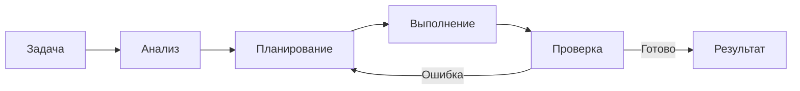

# Плюсы и особенности Claude Code

!!! info "Что ты узнаешь"
    - Что такое Claude Code и чем он отличается от обычного чата с ИИ
    - Ключевые возможности: работа с файлами, git, bash, sub-agents
    - Почему Claude Code — это агент, а не просто чат-бот

## Введение

Claude Code — это агентный ИИ-ассистент от Anthropic, который работает прямо в твоём терминале. В отличие от обычного чата с Claude, здесь ИИ получает доступ к файловой системе, может запускать команды, работать с git и редактировать код напрямую.

Представь себе опытного разработчика, который сидит рядом и может не только советовать, но и сам писать код, запускать тесты, делать коммиты. Именно так работает Claude Code — это полноценный агент, а не просто «окошко для вопросов».

## Что делает Claude Code агентом

Обычный чат с ИИ работает по схеме «вопрос → ответ». Claude Code работает иначе — по агентному циклу:

1. **Получает задачу** — ты описываешь, что нужно сделать
2. **Анализирует контекст** — читает файлы проекта, изучает структуру
3. **Планирует действия** — решает, какие шаги нужны
4. **Выполняет** — редактирует файлы, запускает команды
5. **Проверяет результат** — смотрит на вывод, исправляет ошибки



## Ключевые возможности

### Полный доступ к файловой системе

Claude Code читает и записывает файлы в твоём проекте. Не нужно копировать код в чат — ИИ сам найдёт нужный файл, прочитает его и внесёт изменения.

### Работа с терминалом

Агент может запускать bash-команды: установить зависимости, запустить тесты, проверить статус git. Всё это — без переключения между окнами.

```bash
# Claude Code может выполнять такие команды за тебя:
npm install
npm test
git status
git commit -m "fix: исправлен баг с валидацией"
```

### Поддержка нескольких моделей

Ты можешь переключаться между моделями прямо в сессии:

| Модель | Сила | Когда использовать |
|--------|------|--------------------|
| **Opus** | Самая мощная | Архитектура, сложный рефакторинг |
| **Sonnet** | Баланс | Ежедневная работа, фичи, тесты |
| **Haiku** | Быстрая | Простые правки, документация |

### Система permissions

Claude Code не делает ничего без твоего ведома. Система permissions контролирует, какие действия агент может выполнять автоматически, а какие требуют подтверждения.

### Расширяемость

- **CLAUDE.md** — файл с правилами проекта, который Claude Code читает автоматически
- **Hooks** — скрипты, срабатывающие на определённых этапах работы
- **MCP** — протокол для подключения внешних инструментов
- **Skills** — переиспользуемые наборы инструкций
- **Sub-agents** — дочерние агенты для делегирования подзадач

## Чем Claude Code отличается от «просто чата»

| Аспект | Обычный чат | Claude Code |
|--------|-------------|-------------|
| Доступ к файлам | Нет, нужно копировать | Да, читает/пишет напрямую |
| Запуск команд | Нет | Да, bash/git/npm и т.д. |
| Контекст проекта | Только то, что вставил | Весь проект через CLAUDE.md |
| Автоматизация | Нет | Hooks, MCP, headless-режим |
| Многошаговые задачи | Ручное копирование | Агентный цикл |

## Практика

Пока не устанавливая Claude Code, подумай о своём текущем проекте:

1. Какие задачи ты мог бы делегировать агенту?
2. Какие рутинные действия повторяешь каждый день?
3. Где тебе не хватает «второй пары рук»?

Запиши 3-5 таких задач — они пригодятся, когда мы дойдём до практических уроков.

## Итоги

- Claude Code — агентный ИИ-ассистент, работающий в терминале
- Он имеет полный доступ к файлам, git и bash
- Поддерживает три модели: Opus, Sonnet, Haiku
- Расширяется через CLAUDE.md, hooks, MCP, skills и sub-agents
- Это не чат-бот, а полноценный агент с циклом «анализ → действие → проверка»

## Проверь себя

<div class="quiz-block" data-quiz-id="u01-q1" data-answer="c">
  <div class="quiz-question">Что делает Claude Code агентом, а не просто чат-ботом?</div>
  <label><input type="radio" name="u01-q1" value="a"> Он работает в браузере</label>
  <label><input type="radio" name="u01-q1" value="b"> Он отвечает быстрее</label>
  <label><input type="radio" name="u01-q1" value="c"> Он может читать файлы, запускать команды и редактировать код</label>
  <button class="quiz-btn" onclick="checkQuiz(this)">Проверить</button>
  <div class="quiz-result"></div>
</div>

<div class="quiz-block" data-quiz-id="u01-q2" data-answer="b">
  <div class="quiz-question">Где работает Claude Code?</div>
  <label><input type="radio" name="u01-q2" value="a"> В браузере как веб-приложение</label>
  <label><input type="radio" name="u01-q2" value="b"> В терминале (CLI)</label>
  <label><input type="radio" name="u01-q2" value="c"> Только в VS Code</label>
  <button class="quiz-btn" onclick="checkQuiz(this)">Проверить</button>
  <div class="quiz-result"></div>
</div>

<div class="quiz-block" data-quiz-id="u01-q3" data-answer="a">
  <div class="quiz-question">Какая модель Claude подходит для сложных архитектурных решений?</div>
  <label><input type="radio" name="u01-q3" value="a"> Opus</label>
  <label><input type="radio" name="u01-q3" value="b"> Sonnet</label>
  <label><input type="radio" name="u01-q3" value="c"> Haiku</label>
  <button class="quiz-btn" onclick="checkQuiz(this)">Проверить</button>
  <div class="quiz-result"></div>
</div>

<div class="quiz-block" data-quiz-id="u01-q4" data-answer="b">
  <div class="quiz-question">Какой файл содержит правила проекта для Claude Code?</div>
  <label><input type="radio" name="u01-q4" value="a"> .cursorrules</label>
  <label><input type="radio" name="u01-q4" value="b"> CLAUDE.md</label>
  <label><input type="radio" name="u01-q4" value="c"> config.json</label>
  <button class="quiz-btn" onclick="checkQuiz(this)">Проверить</button>
  <div class="quiz-result"></div>
</div>
