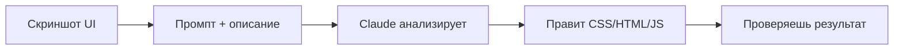

# Как заставить Claude Code править UI по скриншоту

!!! info "Что ты узнаешь"
    - Как передать скриншот в Claude Code
    - Workflow правки UI по изображению
    - Лучшие практики для точных правок

## Введение

Claude Code поддерживает vision — анализ изображений. Ты можешь показать скриншот UI, описать проблему, и Claude Code исправит код. Это мощный workflow для фронтенд-разработки.

## Workflow



1. **Сделай скриншот** — покажи текущее состояние UI
2. **Опиши проблему** — что нужно исправить
3. **Claude Code проанализирует** — поймёт что на скриншоте и что нужно изменить
4. **Внесёт правки** — изменит CSS, HTML или JS

## Как передать скриншот

Перетащи изображение (drag & drop) прямо в терминал Claude Code или укажи путь к файлу:

```
Посмотри на скриншот /tmp/screenshot.png — кнопка «Отправить»
слишком маленькая на мобильных. Увеличь до min-height 48px.
```

## Примеры промптов

### Проблема с выравниванием

```
Посмотри скриншот — заголовок съехал вправо.
Исправь выравнивание в CSS, сделай по центру.
```

### Проблема с размерами

```
На скриншоте видно, что кнопки слишком мелкие.
Увеличь все кнопки в форме до padding 12px 24px.
```

### Проблема с цветами

```
Текст плохо читается на тёмном фоне (смотри скриншот).
Измени цвет текста на #ffffff.
```

## Лучшие практики

!!! tip "Для лучших результатов"
    - Делай чёткий скриншот (не размытый)
    - Обводи проблемную область (можно в Paint/Preview)
    - Описывай конкретно: «кнопка в правом верхнем углу», а не «кнопка»
    - Указывай файл, если знаешь: «в styles/header.css»

!!! warning "Ограничения"
    - Claude Code видит только статику (не анимации)
    - Не видит hover-состояния
    - Не может взаимодействовать с UI
    - Сложные layout-проблемы могут потребовать несколько итераций

## Практика

1. Открой свой проект в браузере
2. Сделай скриншот проблемного элемента
3. Передай Claude Code с описанием проблемы
4. Проверь результат в браузере

## Итоги

- Claude Code анализирует скриншоты через vision
- Workflow: скриншот → описание → правка → проверка
- Будь конкретным: указывай элемент, файл, желаемый результат
- Ограничения: только статика, нет hover/анимаций

## Проверь себя

<div class="quiz-block" data-quiz-id="u18-q1" data-answer="b">
  <div class="quiz-question">Как передать скриншот в Claude Code?</div>
  <label><input type="radio" name="u18-q1" value="a"> Только через URL</label>
  <label><input type="radio" name="u18-q1" value="b"> Drag & drop или указать путь к файлу</label>
  <label><input type="radio" name="u18-q1" value="c"> Только через буфер обмена</label>
  <button class="quiz-btn" onclick="checkQuiz(this)">Проверить</button>
  <div class="quiz-result"></div>
</div>

<div class="quiz-block" data-quiz-id="u18-q2" data-answer="c">
  <div class="quiz-question">Что Claude Code НЕ может увидеть на скриншоте?</div>
  <label><input type="radio" name="u18-q2" value="a"> Цвета элементов</label>
  <label><input type="radio" name="u18-q2" value="b"> Расположение кнопок</label>
  <label><input type="radio" name="u18-q2" value="c"> Hover-состояния и анимации</label>
  <button class="quiz-btn" onclick="checkQuiz(this)">Проверить</button>
  <div class="quiz-result"></div>
</div>

<div class="quiz-block" data-quiz-id="u18-q3" data-answer="a">
  <div class="quiz-question">Какой промпт даст лучший результат?</div>
  <label><input type="radio" name="u18-q3" value="a"> «Кнопка в правом верхнем углу слишком маленькая, увеличь до 48px, файл header.css»</label>
  <label><input type="radio" name="u18-q3" value="b"> «Исправь UI»</label>
  <label><input type="radio" name="u18-q3" value="c"> «Что-то не так с дизайном»</label>
  <button class="quiz-btn" onclick="checkQuiz(this)">Проверить</button>
  <div class="quiz-result"></div>
</div>
