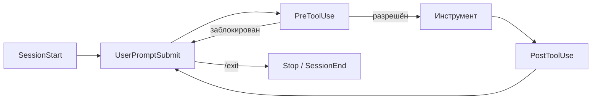

# Что такое Hooks

!!! info "Что ты узнаешь"
    - Что такое hooks и зачем они нужны
    - Какие события поддерживаются сейчас
    - Как выглядит корректная структура `settings.json`

## Введение

Hooks — это автоматические команды, которые Claude Code выполняет на событиях жизненного цикла сессии и инструментов.



Они нужны для трёх задач:

- безопасность (блокировка рискованных действий)
- автоматизация (линтеры, тесты, уведомления)
- наблюдаемость (логирование и аудит)

## Актуальные события

По текущей документации поддерживаются:

| Событие | Когда срабатывает |
|---------|-------------------|
| `SessionStart` | При запуске или возобновлении сессии |
| `SessionEnd` | При завершении сессии |
| `UserPromptSubmit` | При отправке пользовательского промпта |
| `PreToolUse` | До вызова инструмента (может блокировать) |
| `PostToolUse` | После успешного вызова инструмента |
| `PostToolUseFailure` | После неудачного вызова инструмента |
| `PermissionRequest` | Когда Claude запрашивает разрешение |
| `Notification` | При уведомлениях пользователю |
| `Stop` | При остановке агента |
| `SubagentStart` | При запуске подагента |
| `SubagentStop` | При завершении подагента |
| `PreCompact` | Перед сжатием контекста |
| `ConfigChange` | При изменении конфигурации |
| `WorktreeCreate` | При создании git worktree |
| `WorktreeRemove` | При удалении git worktree |
| `TeammateIdle` | Когда агент-напарник освобождается (agent teams) |
| `TaskCompleted` | Когда задача завершена (agent teams) |

## Корректная структура hooks

```json
{
  "hooks": {
    "PreToolUse": [
      {
        "matcher": "Bash",
        "hooks": [
          {
            "type": "command",
            "command": "echo 'PreToolUse Bash triggered'"
          }
        ]
      }
    ]
  }
}
```

Для событий без matcher (например `SessionStart`, `Notification`, `Stop`) поле `matcher` можно не указывать.

## Важные технические детали

- Входные данные hook получает через `stdin` в JSON
- Команды запускаются параллельно для всех совпавших правил
- `timeout` задаётся в **секундах** внутри конкретной `command`-hook записи

## Что дальше

- [Урок 29](29-hooks-configuration.md) — конфигурация hooks в `settings.json`
- [Урок 34](34-hooks-env-variables.md) — переменные окружения для хуков
- [Урок 35](35-hooks-matchers-patterns.md) — паттерны и матчеры
- [Урок 40](40-headless-mode.md) — hooks в headless-режиме (CI/CD)

## Практика

1. Добавь минимальный `PreToolUse` для `Bash`.
2. Добавь `PostToolUse` для `Write`.
3. Проверь, что хуки срабатывают в нужных ситуациях.

## Итоги

- Hooks — событийный механизм контроля Claude Code
- Ключ к корректной работе: правильная JSON-структура и matchers
- Нельзя опираться на устаревшие примеры с другим форматом

## Проверь себя

<div class="quiz-block" data-quiz-id="u28-q1" data-answer="c" markdown>
  <div class="quiz-question">Что такое hooks в Claude Code?</div>
  <label><input type="radio" name="u28-q1" value="a"> Markdown-правила</label>
  <label><input type="radio" name="u28-q1" value="b"> Только уведомления</label>
  <label><input type="radio" name="u28-q1" value="c"> Событийные команды автоматизации</label>
  <button class="quiz-btn" onclick="checkQuiz(this)">Проверить</button>
  <div class="quiz-result"></div>
</div>

<div class="quiz-block" data-quiz-id="u28-q2" data-answer="a" markdown>
  <div class="quiz-question">Какая структура корректна для hooks?</div>
  <label><input type="radio" name="u28-q2" value="a"> "hooks": { "EventName": [ ... ] }</label>
  <label><input type="radio" name="u28-q2" value="b"> "hooks": [ { "eventName": ... } ]</label>
  <label><input type="radio" name="u28-q2" value="c"> "events": [ ... ]</label>
  <button class="quiz-btn" onclick="checkQuiz(this)">Проверить</button>
  <div class="quiz-result"></div>
</div>

<div class="quiz-block" data-quiz-id="u28-q3" data-answer="b" markdown>
  <div class="quiz-question">Где hook получает входные данные о событии?</div>
  <label><input type="radio" name="u28-q3" value="a"> Из .env</label>
  <label><input type="radio" name="u28-q3" value="b"> Через stdin в JSON</label>
  <label><input type="radio" name="u28-q3" value="c"> Из query-параметров URL</label>
  <button class="quiz-btn" onclick="checkQuiz(this)">Проверить</button>
  <div class="quiz-result"></div>
</div>
