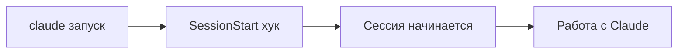

# Автоматизируем инициализацию через хук SessionStart

!!! info "Что ты узнаешь"
    - Что такое хук SessionStart и когда он срабатывает
    - Практические примеры автоинициализации
    - Как настроить и отладить

## Введение

SessionStart — хук, который срабатывает один раз при начале сессии Claude Code. Это идеальное место для автоматической инициализации: проверки окружения, загрузки статуса, подготовки рабочей среды.

## Когда срабатывает



SessionStart выполняется **до** первого промпта. Его вывод (stdout) попадает в контекст — Claude Code увидит результат.

## Настройка

```json
{
  "hooks": {
    "SessionStart": [
      {
        "command": ".claude/hooks/init.sh",
        "timeout": 10000
      }
    ]
  }
}
```

## Примеры

### Показать git status при старте

```bash
#!/bin/bash
# .claude/hooks/init.sh

echo "=== Git Status ==="
git status --short

echo "=== Текущая ветка ==="
git branch --show-current

echo "=== Последний коммит ==="
git log --oneline -1
```

### Проверка зависимостей

```bash
#!/bin/bash
# Проверяем, установлены ли зависимости
if [ -f "package.json" ] && [ ! -d "node_modules" ]; then
    echo "⚠️ node_modules отсутствует. Запусти npm install."
fi

if [ -f "requirements.txt" ] && [ ! -d ".venv" ]; then
    echo "⚠️ Виртуальное окружение не найдено. Создай .venv."
fi
```

### Загрузка TODO

```bash
#!/bin/bash
# Показываем незавершённые задачи
if [ -f "TODO.md" ]; then
    echo "=== TODO ==="
    grep -c "\\- \\[ \\]" TODO.md | xargs -I {} echo "Незавершённых задач: {}"
fi
```

!!! tip "Совет"
    Не делай SessionStart слишком долгим — он задерживает начало работы. Держи timeout < 10 секунд.

## Практика

1. Создай файл `.claude/hooks/init.sh`
2. Добавь вывод `git status` и текущей ветки
3. Настрой хук через `/hooks` → SessionStart
4. Перезапусти Claude Code и проверь вывод

## Итоги

- SessionStart срабатывает один раз при старте сессии
- Stdout хука попадает в контекст Claude
- Полезно для git status, проверки зависимостей, TODO
- Держи хук быстрым (< 10 секунд)

## Проверь себя

<div class="quiz-block" data-quiz-id="u30-q1" data-answer="a">
  <div class="quiz-question">Когда срабатывает хук SessionStart?</div>
  <label><input type="radio" name="u30-q1" value="a"> Один раз при начале сессии</label>
  <label><input type="radio" name="u30-q1" value="b"> Перед каждым промптом</label>
  <label><input type="radio" name="u30-q1" value="c"> При завершении сессии</label>
  <button class="quiz-btn" onclick="checkQuiz(this)">Проверить</button>
  <div class="quiz-result"></div>
</div>

<div class="quiz-block" data-quiz-id="u30-q2" data-answer="b">
  <div class="quiz-question">Куда попадает stdout хука SessionStart?</div>
  <label><input type="radio" name="u30-q2" value="a"> В лог-файл</label>
  <label><input type="radio" name="u30-q2" value="b"> В контекст Claude Code</label>
  <label><input type="radio" name="u30-q2" value="c"> На экран пользователя</label>
  <button class="quiz-btn" onclick="checkQuiz(this)">Проверить</button>
  <div class="quiz-result"></div>
</div>

<div class="quiz-block" data-quiz-id="u30-q3" data-answer="c">
  <div class="quiz-question">Почему SessionStart-хук должен быть быстрым?</div>
  <label><input type="radio" name="u30-q3" value="a"> Иначе Claude Code вылетит</label>
  <label><input type="radio" name="u30-q3" value="b"> Он работает в синхронном режиме и блокирует API</label>
  <label><input type="radio" name="u30-q3" value="c"> Он задерживает начало работы</label>
  <button class="quiz-btn" onclick="checkQuiz(this)">Проверить</button>
  <div class="quiz-result"></div>
</div>
