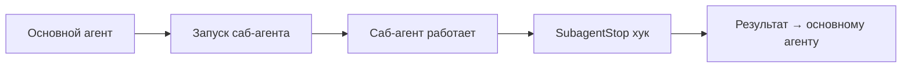

# SubagentStop хук — обработка промпта перед отправкой

!!! info "Что ты узнаешь"
    - Что такое хук SubagentStop и когда он срабатывает
    - Как обрабатывать результат саб-агента
    - Практические сценарии использования

## Введение

SubagentStop — хук, который срабатывает при завершении работы саб-агента. Он позволяет обработать результат, добавить дополнительный контекст или выполнить постобработку перед тем, как результат вернётся основному агенту.

## Когда срабатывает



## Настройка

```json
{
  "hooks": {
    "SubagentStop": [
      {
        "command": ".claude/hooks/subagent-post.sh",
        "timeout": 5000
      }
    ]
  }
}
```

## Примеры

### Логирование работы саб-агентов

```bash
#!/bin/bash
# .claude/hooks/subagent-post.sh

echo "[$(date)] Саб-агент завершил работу" >> .claude/logs/subagents.log
```

### Добавление контекста

```bash
#!/bin/bash
# Добавляем контекст из файла, чтобы основной агент учёл его
if [ -f ".claude/context/extra-rules.md" ]; then
    cat .claude/context/extra-rules.md
fi
```

Всё, что хук выведет в stdout, попадёт в контекст основного агента.

### Валидация результата

```bash
#!/bin/bash
# Проверяем, что саб-агент не оставил TODO-маркеры
if grep -r "TODO" --include="*.ts" --include="*.js" src/ 2>/dev/null; then
    echo "⚠️ Саб-агент оставил TODO-маркеры в коде. Проверь и удали."
fi
```

## Практика

1. Создай скрипт `.claude/hooks/subagent-post.sh`
2. Добавь логирование времени завершения
3. Настрой хук через `/hooks` → SubagentStop
4. Запусти задачу, которая использует саб-агента, и проверь лог

## Итоги

- SubagentStop срабатывает при завершении саб-агента
- Stdout хука добавляется в контекст основного агента
- Полезно для логирования, добавления контекста, валидации
- Настраивается как и другие хуки — через `/hooks` или settings.json

## Проверь себя

<div class="quiz-block" data-quiz-id="u36-q1" data-answer="b">
  <div class="quiz-question">Когда срабатывает хук SubagentStop?</div>
  <label><input type="radio" name="u36-q1" value="a"> При запуске саб-агента</label>
  <label><input type="radio" name="u36-q1" value="b"> При завершении работы саб-агента</label>
  <label><input type="radio" name="u36-q1" value="c"> При ошибке саб-агента</label>
  <button class="quiz-btn" onclick="checkQuiz(this)">Проверить</button>
  <div class="quiz-result"></div>
</div>

<div class="quiz-block" data-quiz-id="u36-q2" data-answer="a">
  <div class="quiz-question">Куда попадает stdout хука SubagentStop?</div>
  <label><input type="radio" name="u36-q2" value="a"> В контекст основного агента</label>
  <label><input type="radio" name="u36-q2" value="b"> В контекст саб-агента</label>
  <label><input type="radio" name="u36-q2" value="c"> В лог-файл</label>
  <button class="quiz-btn" onclick="checkQuiz(this)">Проверить</button>
  <div class="quiz-result"></div>
</div>

<div class="quiz-block" data-quiz-id="u36-q3" data-answer="c">
  <div class="quiz-question">Какой практический сценарий для SubagentStop?</div>
  <label><input type="radio" name="u36-q3" value="a"> Блокировка запуска саб-агента</label>
  <label><input type="radio" name="u36-q3" value="b"> Изменение промпта саб-агента</label>
  <label><input type="radio" name="u36-q3" value="c"> Логирование и добавление контекста к результату</label>
  <button class="quiz-btn" onclick="checkQuiz(this)">Проверить</button>
  <div class="quiz-result"></div>
</div>
