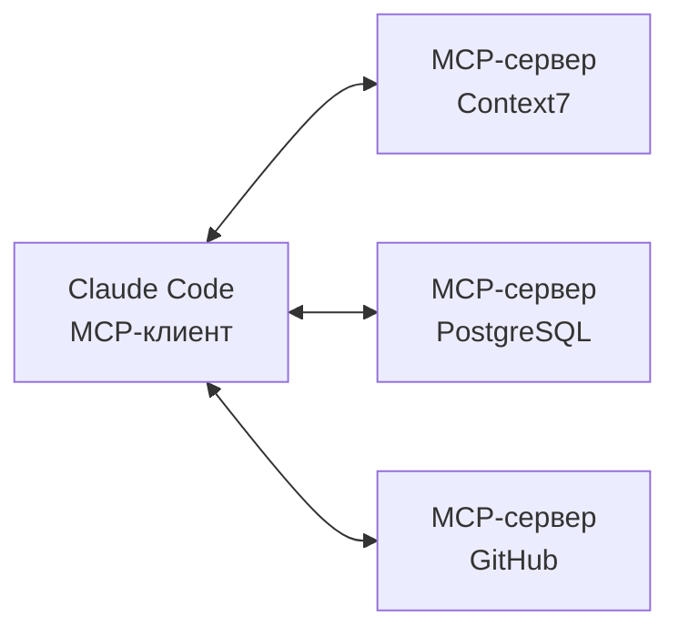

# Что такое MCP

!!! info "Что ты узнаешь"
    - Что такое Model Context Protocol и зачем он нужен
    - Архитектура: клиент, сервер, инструменты
    - Как подключить MCP-сервер к Claude Code

## Введение

MCP (Model Context Protocol) — открытый протокол от Anthropic для подключения внешних инструментов и источников данных к ИИ-ассистентам. Думай о нём как о USB для ИИ — стандартный интерфейс, через который можно подключить что угодно: базу данных, API, файловую систему, документацию.

## Как это работает



- **Claude Code** — MCP-клиент, который отправляет запросы
- **MCP-сервер** — предоставляет инструменты (tools) и ресурсы (resources)
- **Протокол** — стандартный JSON-RPC для общения между ними

## Что может MCP-сервер

MCP-серверы предоставляют:

- **Tools** — действия, которые Claude может выполнять (запрос к БД, вызов API)
- **Resources** — данные, которые Claude может читать (документация, схемы)

## Подключение MCP-сервера

```bash
# Добавить MCP-сервер
claude mcp add имя-сервера -- команда запуска

# Пример: подключить файловый сервер
claude mcp add filesystem -- npx -y @anthropic-ai/mcp-filesystem

# Список подключённых серверов
claude mcp list

# Удалить сервер
claude mcp remove имя-сервера
```

Конфигурация хранится в `.claude/mcp.json`:

```json
{
  "mcpServers": {
    "filesystem": {
      "command": "npx",
      "args": ["-y", "@anthropic-ai/mcp-filesystem", "/path/to/dir"]
    }
  }
}
```

## Популярные MCP-серверы

| Сервер | Что делает |
|--------|-----------|
| Context7 | Актуальная документация библиотек |
| Filesystem | Расширенная работа с файлами |
| PostgreSQL | Запросы к PostgreSQL |
| GitHub | Работа с issues, PR, репозиториями |
| Puppeteer | Управление браузером |

## Практика

1. Выбери MCP-сервер из списка
2. Подключи его: `claude mcp add ...`
3. Запусти Claude Code и попробуй использовать новый инструмент
4. Проверь `.claude/mcp.json`

## Итоги

- MCP — стандартный протокол для подключения внешних инструментов к Claude Code
- Архитектура: Claude Code (клиент) ↔ MCP-серверы
- Подключение: `claude mcp add имя -- команда`
- Конфигурация в `.claude/mcp.json`

## Проверь себя

<div class="quiz-block" data-quiz-id="u37-q1" data-answer="c">
  <div class="quiz-question">Что такое MCP?</div>
  <label><input type="radio" name="u37-q1" value="a"> Формат файлов конфигурации</label>
  <label><input type="radio" name="u37-q1" value="b"> Тип модели Claude</label>
  <label><input type="radio" name="u37-q1" value="c"> Протокол для подключения внешних инструментов к ИИ</label>
  <button class="quiz-btn" onclick="checkQuiz(this)">Проверить</button>
  <div class="quiz-result"></div>
</div>

<div class="quiz-block" data-quiz-id="u37-q2" data-answer="a">
  <div class="quiz-question">Где хранится конфигурация MCP-серверов?</div>
  <label><input type="radio" name="u37-q2" value="a"> .claude/mcp.json</label>
  <label><input type="radio" name="u37-q2" value="b"> .claude/settings.json</label>
  <label><input type="radio" name="u37-q2" value="c"> mcp.config.js</label>
  <button class="quiz-btn" onclick="checkQuiz(this)">Проверить</button>
  <div class="quiz-result"></div>
</div>

<div class="quiz-block" data-quiz-id="u37-q3" data-answer="b">
  <div class="quiz-question">Какая команда подключает MCP-сервер?</div>
  <label><input type="radio" name="u37-q3" value="a"> claude install mcp</label>
  <label><input type="radio" name="u37-q3" value="b"> claude mcp add</label>
  <label><input type="radio" name="u37-q3" value="c"> /mcp connect</label>
  <button class="quiz-btn" onclick="checkQuiz(this)">Проверить</button>
  <div class="quiz-result"></div>
</div>
