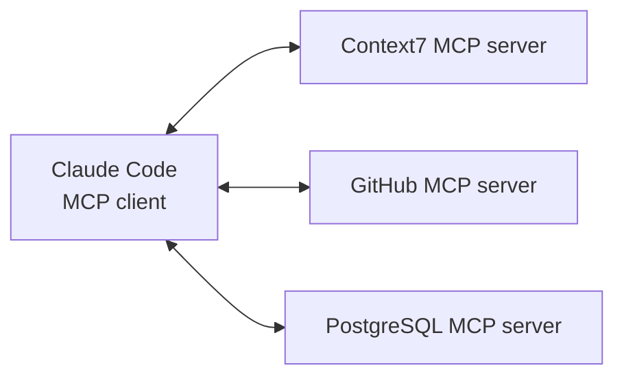

# Что такое MCP

!!! info "Что ты узнаешь"
    - Что такое MCP и зачем он нужен
    - Как подключать MCP-серверы
    - Где хранится конфигурация в актуальной версии

## Введение

MCP (Model Context Protocol) — стандарт подключения внешних инструментов и данных к ИИ-агентам.

Практически это означает: Claude Code может работать не только с локальными файлами, но и с внешними системами (документация, базы, API, GitHub и т.д.).

## Как это работает


```mermaid
graph LR
    A[Claude Code<br/>MCP client] <--> B[Context7 MCP server]
    A <--> C[GitHub MCP server]
    A <--> D[PostgreSQL MCP server]
```

## Базовые команды

```bash
# Добавить MCP-сервер
claude mcp add <name> -- <launch-command>

# Посмотреть список
claude mcp list

# Удалить сервер
claude mcp remove <name>
```

## Где хранится конфиг

Актуально:

- локальный/проектный конфиг: **`.mcp.json`**
- пользовательский уровень: `~/.claude.json`

!!! note "Важно"
    Во многих старых материалах встречается `.claude/mcp.json`.
    Сейчас ориентируйся на `.mcp.json` и актуальную документацию по scope.

## Scope (область действия)

При добавлении MCP-сервера учитывай область:

- local (текущая копия)
- project (для проекта)
- user (для всех проектов пользователя)

Это важно для безопасности и переносимости конфигурации.

## Практика

1. Добавь тестовый MCP-сервер.
2. Проверь, где записался конфиг.
3. Проверь `claude mcp list`.

## Итоги

- MCP даёт Claude Code доступ к внешним инструментам
- Подключение идёт через `claude mcp add`
- Актуальный проектный конфиг — `.mcp.json`
- Scope нужно выбирать осознанно

## Проверь себя

<div class="quiz-block" data-quiz-id="u37-q1" data-answer="c">
  <div class="quiz-question">Что такое MCP?</div>
  <label><input type="radio" name="u37-q1" value="a"> Тип модели</label>
  <label><input type="radio" name="u37-q1" value="b"> Менеджер зависимостей</label>
  <label><input type="radio" name="u37-q1" value="c"> Протокол подключения внешних инструментов к агенту</label>
  <button class="quiz-btn" onclick="checkQuiz(this)">Проверить</button>
  <div class="quiz-result"></div>
</div>

<div class="quiz-block" data-quiz-id="u37-q2" data-answer="b">
  <div class="quiz-question">Какой файл сейчас используется как проектный MCP-конфиг?</div>
  <label><input type="radio" name="u37-q2" value="a"> .claude/mcp.json</label>
  <label><input type="radio" name="u37-q2" value="b"> .mcp.json</label>
  <label><input type="radio" name="u37-q2" value="c"> mcp.config.ts</label>
  <button class="quiz-btn" onclick="checkQuiz(this)">Проверить</button>
  <div class="quiz-result"></div>
</div>

<div class="quiz-block" data-quiz-id="u37-q3" data-answer="a">
  <div class="quiz-question">Какая команда добавляет MCP-сервер?</div>
  <label><input type="radio" name="u37-q3" value="a"> claude mcp add</label>
  <label><input type="radio" name="u37-q3" value="b"> claude mcp install</label>
  <label><input type="radio" name="u37-q3" value="c"> /mcp connect</label>
  <button class="quiz-btn" onclick="checkQuiz(this)">Проверить</button>
  <div class="quiz-result"></div>
</div>
